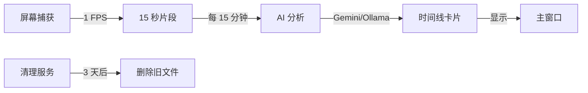

# Dayflow Python - 跨平台版本

<div align="center">
  <h3>📅 自动跟踪您的一天</h3>
  <p>屏幕录制 + AI 时间线生成</p>
  <p><strong>✅ 支持 Windows、macOS 和 Linux</strong></p>
</div>

---

## 🚀 快速开始

### Windows

1. **安装 Python**（如果尚未安装）
   - 从 https://www.python.org/downloads/ 下载
   - **重要**：安装时勾选"Add Python to PATH"
   - 验证：打开命令提示符运行 `python --version`

2. **运行 Dayflow**
   - 双击 `run.bat`
   - 首次启动会自动安装依赖
   - Dayflow 窗口将打开！

3. **配置 AI 提供商**（首次使用）
   - 点击 **⚙️ 设置** 按钮
   - 选择 **Gemini**（云端）或 **Ollama**（本地）
   - 对于 Gemini：从 https://ai.google.dev/ 输入您的 API 密钥
   - 点击 **💾 保存设置**

4. **开始录制**
   - 点击 **🎥 开始录制**
   - 您的时间线将每 15 分钟自动构建！

### macOS / Linux

```bash
# 使启动器可执行
chmod +x run.sh

# 运行 Dayflow
./run.sh
```

或直接使用 Python：

```bash
pip install -r requirements.txt
python3 run.py
```

---

## 📋 功能特性

✅ **1 FPS 屏幕录制** - 最小的 CPU/存储影响
✅ **AI 驱动的时间线** - 自动活动分类
✅ **15 分钟批处理** - 及时分析无延迟
✅ **自动清理** - 3 天后删除录制
✅ **系统托盘** - 后台运行
✅ **Gemini + Ollama 支持** - 云端或本地 AI
✅ **跨平台** - 适用于 Windows、macOS、Linux

---

## 🛠️ 系统要求

- **Python 3.8+**（推荐 3.9 或 3.10）
- **Pip**（包管理器）
- **4GB+ 内存**
- **互联网**（用于 Gemini）或 **Ollama**（用于本地）

---

## 📦 安装

### 选项 1：自动安装（推荐）

**Windows：** 双击 `run.bat`

**macOS/Linux：** 运行 `./run.sh`

首次运行时会自动安装依赖。

### 选项 2：手动安装

```bash
# 安装依赖
pip install -r requirements.txt

# 运行 Dayflow
python run.py
```

### 依赖包

安装的核心包：
- `mss` - 快速屏幕捕获
- `opencv-python` - 视频处理
- `customtkinter` - 现代化 UI
- `pystray` - 系统托盘图标
- `google-generativeai` - Gemini API
- `requests` - Ollama 的 HTTP 客户端

---

## ⚙️ 配置

### AI 提供商

#### 选项 1：Google Gemini（云端，推荐）

**优点：**
- 快速分析（每批 2 次 LLM 调用）
- 高准确度
- 无需本地设置

**缺点：**
- 需要 API 密钥
- 视频发送到 Google 服务器

**设置：**
1. 获取 API 密钥：https://ai.google.dev/gemini-api/docs/api-key
2. 在 Dayflow 中：设置 → Gemini → 输入 API 密钥

#### 选项 2：Ollama（本地，隐私友好）

**优点：**
- 本地运行（无云端）
- 免费
- 隐私友好

**缺点：**
- 需要强大硬件
- 较慢分析（每批 30+ 次 LLM 调用）
- 设置更复杂

**设置：**
1. 安装 Ollama：https://ollama.com/
2. 拉取视觉模型：`ollama pull llava`
3. 在 Dayflow 中：设置 → Ollama → 将 URL 设置为 `http://localhost:11434`

---

## 📂 数据存储

### Windows
```
C:\Users\{您的用户名}\AppData\Local\Dayflow\
├── config.json        # 设置
├── dayflow.db         # 时间线数据库
└── recordings/        # 视频片段（3 天后自动删除）
```

### macOS
```
~/Library/Application Support/Dayflow/
├── config.json
├── dayflow.db
└── recordings/
```

### Linux
```
~/.config/Dayflow/
├── config.json
├── dayflow.db
└── recordings/
```

---

## 🎨 界面概览

### 主窗口

```
┌─────────────────────────────────────────────────┐
│ 📅 Dayflow       ⏸️  未录制                     │
│            [⚡ 立即分析] [⚙️  设置] [🎥 开始]      │
├─────────────────────────────────────────────────┤
│                                                 │
│  今日时间线 - 2025 年 11 月 17 日                 │
│                                                 │
│  ┌─────────────────────────────────────────┐   │
│  │ 14:00 - 14:15                           │   │
│  │ 📝 编写代码                             │   │
│  │ 📁 开发                                 │   │
│  │ 在 VS Code 中处理 Python 脚本...         │   │
│  └─────────────────────────────────────────┘   │
│                                                 │
│  ┌─────────────────────────────────────────┐   │
│  │ 14:15 - 14:30                           │   │
│  │ 🌐 浏览文档                             │   │
│  │ 📁 研究                                 │   │
│  │ 阅读 Python 文档...                      │   │
│  └─────────────────────────────────────────┘   │
│                                                 │
└─────────────────────────────────────────────────┘
```

### 设置

- **AI 提供商** - Gemini 或 Ollama
- **API 密钥** - 用于 Gemini
- **保留天数** - 录制保留天数（1-30）

---

## 🔍 工作原理



1. **录制**：以 1 FPS 捕获屏幕
2. **分段**：保存 15 秒视频片段
3. **分析**：每 15 分钟将片段发送给 AI
4. **时间线**：AI 生成包含标题、摘要、分类的卡片
5. **清理**：3 天后自动删除录制

---

## 🐛 故障排除

### "Python 未安装或不在 PATH 中"

**Windows：**
1. 从 https://www.python.org/ 重新安装 Python
2. 安装时勾选"Add Python to PATH"
3. 重启命令提示符

**macOS/Linux：**
```bash
# 检查是否已安装
python3 --version

# 如果未安装：
# macOS: brew install python3
# Ubuntu: sudo apt install python3 python3-pip
```

### "ModuleNotFoundError: No module named 'mss'"

依赖未安装。手动运行：

```bash
pip install -r requirements.txt
```

### "尚无时间线卡片"

1. 确保录制已开始（🔴 录制指示器）
2. 等待至少 15 分钟进行首次分析
3. 检查 AI 提供商是否在设置中配置
4. 点击 **⚡ 立即分析** 强制立即分析

### "Gemini API 错误"

- 检查 API 密钥是否正确
- 验证 API 密钥已启用 Gemini API
- 检查互联网连接

### "Ollama 连接失败"

- 确保 Ollama 正在运行：`ollama serve`
- 验证 `llava` 模型已安装：`ollama pull llava`
- 检查 URL 是否正确：`http://localhost:11434`

### CPU 使用率过高

- 录制期间正常（1-5% CPU）
- 分析期间高（临时，AI 处理）
- 如果一直很高，检查其他后台进程

---

## 🔒 隐私与安全

### 存储了哪些数据？

- **本地**：所有录制存储在您的用户目录中
- **云端（仅 Gemini）**：视频发送到 Google 进行分析
- **从不收集**：无遥测，无用户跟踪

### 数据保留

- 录制 3 天后自动删除（可配置）
- 时间线数据库无限期保留（本地）
- 可手动删除：删除 AppData 中的 `Dayflow` 文件夹

### Gemini 隐私

使用 Gemini 时：
- 视频临时上传用于分析
- Google 可能存储提示/响应用于滥用监控
- 启用云计费以获得更严格的隐私条款
- 参见：https://ai.google.dev/gemini-api/terms

### Ollama 隐私

使用 Ollama 时：
- 一切都在本地运行
- 没有数据离开您的计算机
- 模型下载后完全离线

---

## 📝 配置选项

手动编辑 `config.json` 进行高级设置：

```json
{
  "fps": 1,                    // 每秒帧数 (1-5)
  "chunk_duration": 15,        // 每段秒数 (10-60)
  "target_height": 1080,       // 视频高度 (720, 1080, 1440)
  "retention_days": 3,         // 保留录制 X 天
  "analysis_interval": 900,    // 每 X 秒分析一次 (900 = 15 分钟)
  "llm_provider": "gemini",    // "gemini" 或 "ollama"
  "gemini_api_key": "...",     // 您的 API 密钥
  "ollama_base_url": "http://localhost:11434",
  "ollama_model": "llava"      // Ollama 视觉模型
}
```

---

## 🧪 开发

### 项目结构

```
dayflow-python/
├── run.py                  # 主启动器
├── run.bat                 # Windows 启动器
├── run.sh                  # macOS/Linux 启动器
├── requirements.txt        # 依赖
├── README.md              # 本文件
└── src/
    ├── app_controller.py   # 主应用逻辑
    ├── core/
    │   ├── config.py       # 配置
    │   ├── storage.py      # SQLite 数据库
    │   ├── recorder.py     # 屏幕捕获
    │   └── cleanup.py      # 自动清理
    ├── ai/
    │   ├── gemini_provider.py
    │   └── ollama_provider.py
    ├── analysis/
    │   └── timeline_generator.py
    └── ui/
        ├── main_window.py  # 主界面
        └── tray_icon.py    # 系统托盘
```

### 从源代码运行

```bash
# 克隆或解压
cd dayflow-python

# 安装依赖
pip install -r requirements.txt

# 运行
python run.py
```

---

## 🚧 已知限制

- **Windows**：某些屏幕捕获场景可能需要以管理员身份运行
- **macOS**：需要屏幕录制权限（系统设置 → 隐私与安全）
- **Linux**：某些功能可能需要 `xdotool`：`sudo apt install xdotool`
- **多显示器**：目前仅捕获主显示器
- **受保护内容**：DRM 内容（Netflix 等）可能显示为黑色

---

## 🔮 发展路线图

未来的增强功能：
- [ ] 多显示器支持
- [ ] 自定义分类和颜色
- [ ] 导出时间线到 PDF/CSV
- [ ] 每日/每周摘要邮件
- [ ] 与日历应用集成
- [ ] 移动伴侣应用
- [ ] 云同步（可选）

---

## 📄 许可证

MIT 许可证 - 详见 LICENSE 文件

---

## 🙏 致谢

- 原始 Dayflow (macOS): https://github.com/JerryZLiu/Dayflow
- 屏幕捕获: `mss` 库
- 视频处理: OpenCV
- 界面: CustomTkinter
- AI: Google Gemini / Ollama

---

## 📞 支持

- **问题**：报告错误或请求功能
- **文档**：查看项目文件夹中的文档
- **社区**：欢迎讨论

---

**为生产力和隐私而制作，充满 ❤️**

